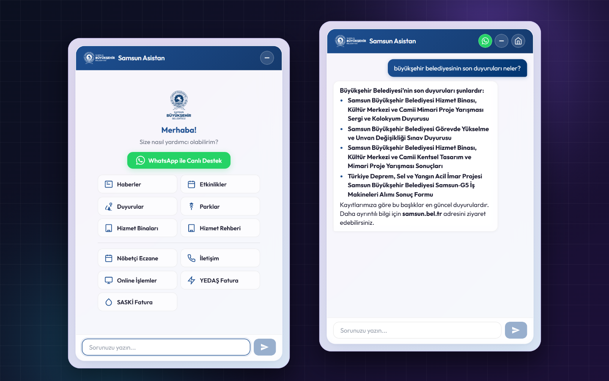

  

  
  
  
   
  

<h3>&nbsp; About me</h3>

I'm a **final-year Computer Science student** at Dokuz Eylül University. I like to solve real problems with software that people use every day. A language school uses a system I built for its daily work, and my city projects make public data easy for people to find and understand.

  

  

<h3>&nbsp; Choose your path</h3>

  
<b>I'm hiring</b> — a quick summary

   

- **Who:** final-year CS student at Dokuz Eylül University, living in İzmir, looking for internships and junior full-stack roles
- **Experience:** I built a management system that a real language school uses every day
- **Skills:** React and TypeScript on the frontend, ASP.NET Core and Node.js on the backend, PostgreSQL, and AI tools with RAG
- **How I work:** I first understand the problem, then build the full product from start to finish
- **Contact:** [send me an email](mailto:mrtolgisme@hotmail.com) or [visit my portfolio](https://www.mertolgun.dev/). I'm happy to show you the private code

  
<b>I'm a developer</b> — the technical details

   

- **Correct balances:** student balances are calculated from payment records each time, so they are always up to date ([case study](https://github.com/mrtolg7/english-academy-admin-panel-showcase))
- **Extra security for finance:** accounting pages need a second password, not only the admin login
- **Safe backups:** backups are saved as JSON files with a SHA-256 check, and a restore either finishes fully or changes nothing
- **Reliable AI answers:** the assistant searches real municipal data first (`bge-m3` + Qdrant). If one AI provider fails, it moves to the next one (Gemini → OpenRouter → Groq) ([case study](https://github.com/mrtolg7/samsun-municipality-ai-assistant-showcase))
- **Smart data collection:** simple pages are read with HttpClient, and pages that need JavaScript are read with Playwright. All data is cleaned before it is shown ([case study](https://github.com/mrtolg7/samsun-districts-explorer-showcase))

  
<b>I'm just browsing</b> — just for fun

   

- Scroll down to see my first small projects and a snake that eats my contribution graph
- Every commit on this profile was powered by coffee (yes, the ∞ above is real)
- You found the secret part! [Say hello](mailto:mrtolgisme@hotmail.com?subject=I%20found%20the%20easter%20egg) and tell me how you found it

<h3>&nbsp; Featured projects</h3>

<table>
  <tr>
    <td width="50%" valign="top">
      
      <h4>&nbsp; English Academy — Operations Platform</h4>
      
      
One system for students, classes, attendance and payments. It calculates balances from real payment records, protects finance pages with a second password and has safe backups.

      <code>React</code> <code>Express 5</code> <code>PostgreSQL</code> <code>Railway</code>
        
      
    </td>
    <td width="50%" valign="top">
      
      <h4>&nbsp; Municipal AI Information Assistant</h4>
      
      
An AI chat assistant for city information. It collects municipal news every hour, searches it with <code>bge-m3</code> and Qdrant, and answers in real time. If it can't find the answer, it says so.

      <code>.NET</code> <code>Qdrant</code> <code>Ollama</code> <code>React</code>
        
      
    </td>
  </tr>
  <tr>
    <td width="50%" valign="top">
      
      <h4>&nbsp; Samsun Districts Explorer</h4>
      
      
Collects data from many public websites and puts it in one place: population by year, mayors and 2024 election results for every neighbourhood.

      <code>ASP.NET Core</code> <code>Playwright</code> <code>SQLite</code> <code>React</code>
        
      
    </td>
    <td width="50%" valign="top">
      <h4>&nbsp; Other projects</h4>

- [**mert-olgun-personal-website**](https://github.com/mrtolg7/mert-olgun-personal-website) — my portfolio, built with TypeScript
- [**rentacar-api**](https://github.com/mrtolg7/rentacar-api) + [**rentacar-ui**](https://github.com/mrtolg7/rentacar-ui) — PHP API with a JS frontend
- [**breast-cancer-clustering-analysis**](https://github.com/mrtolg7/breast-cancer-clustering-analysis) — grouping breast cancer data with machine learning
- [**pintos-project**](https://github.com/mrtolg7/pintos-project) — operating system project written in C
- [**ecommerce-app**](https://github.com/mrtolg7/ecommerce-app) — e-commerce app in JavaScript

Showcase repos only have documentation. I can show the code if you ask.
    </td>
  </tr>
</table>

<h3>&nbsp; Tech stack</h3>

  

  
  
  
  
  
  

<h3>&nbsp; How I work</h3>

<table>
  <tr>
    <td width="50%" valign="top">
      &nbsp; <b>Product thinking first</b> 
      I first learn how people work today, then I design the software.
    </td>
    <td width="50%" valign="top">
      &nbsp; <b>Security first</b> 
      Sensitive pages get extra protection, and secret keys never go to the browser.
    </td>
  </tr>
  <tr>
    <td width="50%" valign="top">
      &nbsp; <b>Honest results</b> 
      I only share numbers that I can prove with tests.
    </td>
    <td width="50%" valign="top">
      &nbsp; <b>Easy to use</b> 
      Even complex tasks should feel simple for the user.
    </td>
  </tr>
</table>

  
<b>Side quests unlocked</b> — my first small projects (click to open)

   
  

    
    
    
    
    
    
    
    
  

  
Every big project starts small, like a drum kit that plays a sound when you press "W".

<h3>&nbsp; Snake eating my contributions</h3>

  <picture>
    <source media="(prefers-color-scheme: dark)" srcset="https://raw.githubusercontent.com/mrtolg7/mrtolg7/output/github-snake-dark.svg"/>
    <source media="(prefers-color-scheme: light)" srcset="https://raw.githubusercontent.com/mrtolg7/mrtolg7/output/github-snake.svg"/>
    
  </picture>

  

